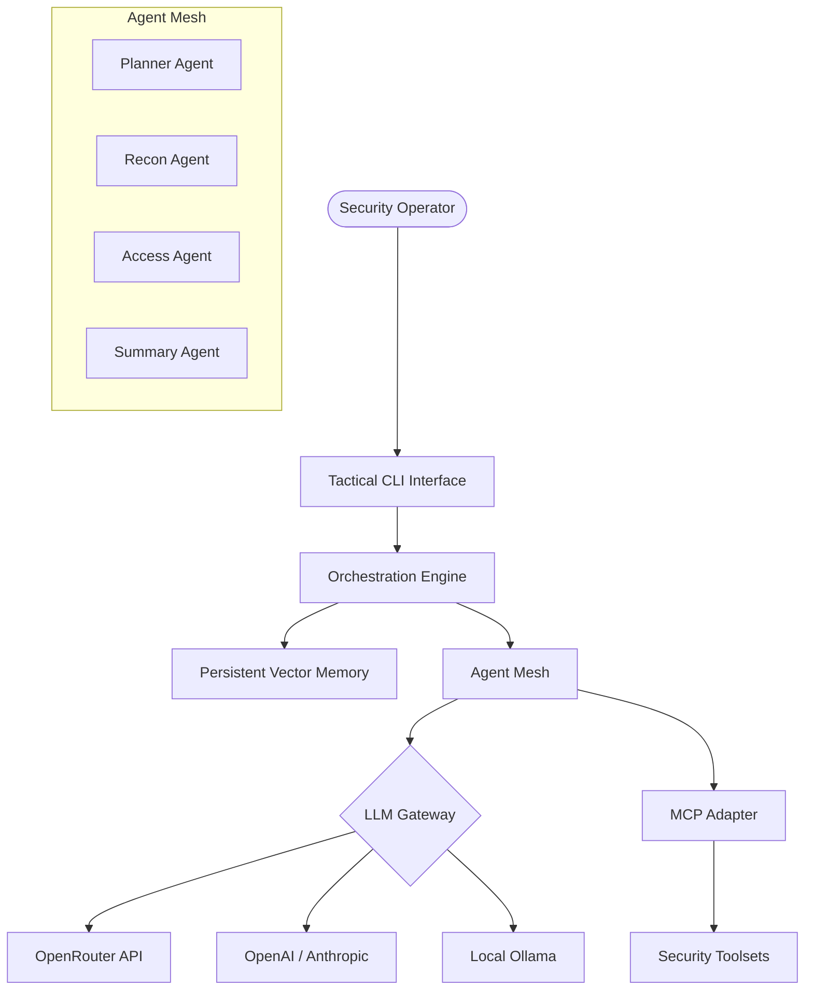

# <p align="center">🕵️‍♂️ DECEPTICON: The Ultimate Vibe Hacking Agent</p>

<p align="center">
  
  
  
  
  
</p>

---

## 🚀 Overview

**DECEPTICON** is a cutting-edge, AI-powered red teaming and security reconnaissance system. Engineered for professional security operators, it orchestrates a swarm of specialized AI agents to autonomously discover, analyze, and exploit vulnerabilities using a **"Vibe Hacking"** methodology—a fusion of behavioral intelligence and technical exploit precision.

<p align="center">
  
  <br>
  <i>The DECEPTICON Tactical CLI in action</i>
</p>

Unlike manual reconnaissance tools, **DECEPTICON** functions as a high-level supervisor, delegating complex technical chains to a dynamic agent mesh that self-corrects and adapts to target defenses in real-time.

---

## ✨ Key Features

### 🎯 Multi-Agent Swarm Orchestration
Deploy a coordinated "swarm" of agents that communicate through a shared state. The swarm self-organizes based on the mission objective, ensuring that reconnaissance findings directly inform initial access attempts without manual intervention.

### 🌐 Universal LLM Mesh
Connect to any elite LLM provider to power your agents:
- **Cloud Powerhouses**: Direct integration with GPT-4o, Claude 3.7 Sonnet, and OpenAI o1-series.
- **OpenRouter Gateway**: Access DeepSeek V3, R1, Mistral Large, and Llama 3.1 405B via a single API.
- **Local Privacy**: Run small, specialized models (Llama 3, Phi-3, Mistral) locally via Ollama.

### 🛠️ Native MCP Infrastructure
Deep-native support for the **Model Context Protocol (MCP)** allows DECEPTICON to "plug in" to any environment:
- **System Control**: Direct terminal execution and file system manipulation.
- **Intelligence**: Real-time web-search and OSINT gathering.
- **Tool Expansion**: Easily add new security tools (Nmap, Metasploit, etc.) as MCP servers.

---

## 📖 How To Work With DECEPTICON (Example Mission)

A typical security mission with DECEPTICON follows a structured, autonomous lifecycle. Here is a step-by-step example of how to execute a reconnaissance mission.

### Step 1: Initialization
Launch the tactical CLI and select your preferred LLM model (e.g., **DeepSeek V3 via OpenRouter** for high-efficiency reasoning).

```bash
python frontend/cli/cli.py
```

### Step 2: Set the Mission Objective
Once the session is ready, provide a high-level goal. You don't need to give specific commands—just describe what you want to achieve.

**Operator:** *"Perform a fast scan and vulnerability assessment for the local network 172.10.0.0/24. Focus on web servers and database ports."*

### Step 3: Autonomous Orchestration
The **Planner Agent** will analyze your request and break it down into tasks:
1.  **Recon Agent** starts an `nmap -F` scan via the Terminal MCP server.
2.  **Researcher Agent** monitors the scan results; if a web server is found, it automatically checks the service versions against known CVE databases.
3.  **Access Agent** (if enabled) might attempt a non-intrusive metadata pull or credential check on discovered services.

### Step 4: Real-time Analysis & Reporting
As findings are logged, the **Summary Agent** compiles everything into a tactical report. You can ask for updates at any time:

**Operator:** *"What is the current status of the 172.10.0.3 target?"*
**DECEPTICON:** *"Target 172.10.0.3 is up. Ports 80 and 443 are open. Running Nginx 1.18.0. Researcher detected a potential misconfiguration in the SSL headers. Proceeding with detailed vuln-scan..."*

### Step 5: Mission Debrief
Upon completion, DECEPTICON generates a final markdown report of all findings, which you can export for your red team documentation.

---

## 🧠 Core Agent Roles

| Agent | Mission Specialist | Capabilities |
|---|---|---|
| **Reconnaissance** | The Scout | Port scanning, service enumeration, DNS lookups, and vuln-scanning. |
| **Initial Access** | The Breacher | Credential stuffing, exploit execution, and payload delivery. |
| **Researcher** | The Analyst | Zero-day research, CVE analysis, and documentation synthesis. |
| **Planner** | The Architect | High-level mission planning and multi-stage workflow orchestration. |
| **Summary** | The Reporter | Intelligence compilation and comprehensive executive reporting. |

---

## 🧩 Advanced Architecture



---

## 🚦 Installation & Setup

1. **Clone & Sync:**
```bash
git clone https://github.com/PurpleAILAB/Decepticon.git
cd Decepticon
uv sync
```

2. **Keys:** Populate `.env` with `OPENAI_API_KEY`, `OPENROUTER_API_KEY`, etc.

3. **Deploy Target Environment (Optional):**
```bash
docker-compose up -d
```

---

## 🛡️ Responsible Use & Legal
**DECEPTICON** is a powerful security instrument. It must only be used against systems you own or have explicit authorization to test. Purple AI LAB does not condone illegal activities.

---

<p align="center">
  <b>Unlocking the Future of AI-Driven Cyber Operations.</b><br>
  Built with ⚡ by <b>Purple AI LAB</b>
</p>
