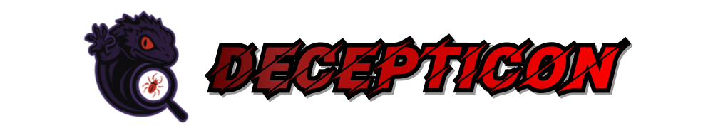
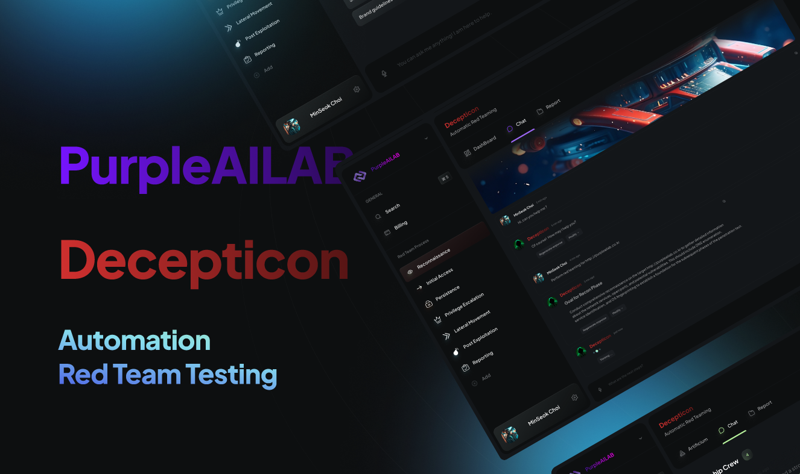
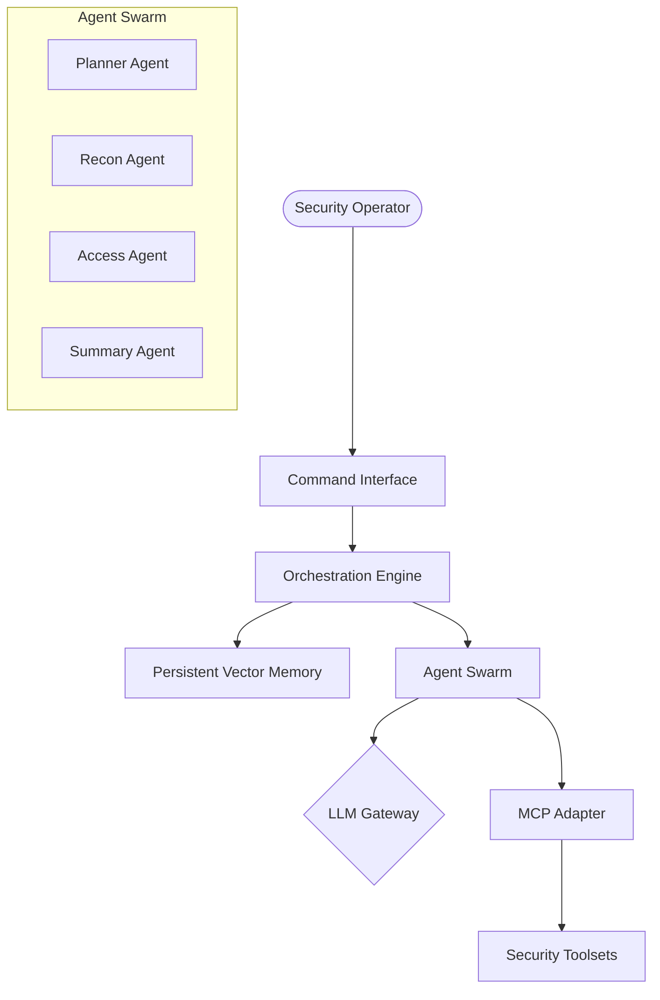

# <p align="center"></p>

<h1 align="center">🕵️‍♂️ DECEPTICON: The Ultimate Vibe Hacking Agent</h1>

<p align="center">
  <a href="https://github.com/PurpleAILAB/Decepticon">
    
  </a>
  
  
  
  
</p>

<p align="center">
  <strong>Orchestrate a swarm of elite AI agents for autonomous red teaming, reconnaissance, and technical exploitation.</strong>
</p>

---

## 🚀 Overview

**DECEPTICON** is a cutting-edge, AI-powered red teaming and security reconnaissance system. Engineered for professional security operators, it orchestrates a swarm of specialized AI agents to autonomously discover, analyze, and exploit vulnerabilities using a **"Vibe Hacking"** methodology—a fusion of behavioral intelligence and technical exploit precision.

Unlike manual reconnaissance tools, **DECEPTICON** functions as a high-level supervisor, delegating complex technical chains to a dynamic agent mesh that self-corrects and adapts to target defenses in real-time.

<p align="center">
  
  <br>
  <i>The DECEPTICON Autonomous Command Center</i>
</p>

---

## ✨ Key Features

### 🎯 Multi-Agent Swarm Orchestration
Deploy a coordinated "swarm" of agents that communicate through a shared state. The swarm self-organizes based on the mission objective, ensuring that reconnaissance findings directly inform initial access attempts.

### 🌐 Universal LLM Mesh
Connect to any elite LLM provider:
- **Cloud Models**: GPT-4o, Claude 3.7 Sonnet, OpenAI o1-series.
- **Unified Gateway**: Access DeepSeek V3/R1, Mistral, and Llama 3.1 via **OpenRouter**.
- **Local Privacy**: Native support for **Ollama** (Llama 3, Mistral, Phi-3).

### 🛠️ Native MCP Infrastructure
Deep-native support for the **Model Context Protocol (MCP)**:
- **Direct Control**: Terminal execution and filesystem manipulation via specialized servers.
- **Live Intelligence**: Real-time web-search and OSINT gathering.
- **Extensible**: Integrate custom tools (Nmap, Metasploit, etc.) as MCP servers.

---

## 🧩 Advanced Architecture

DECEPTICON utilizes **LangGraph** to manage the state and transitions between different agent roles, creating a robust, cyclic workflow that mimics a professional red team operation.



---

## 🚦 Installation & Setup

### 1. Prerequisites
- **Python**: 3.11 or higher.
- **UV**: (Highly Recommended) For lightning-fast dependency management.
- **Docker**: For running target lab environments.

### 2. Local Setup (Windows/Linux)

```bash
# Clone the repository
git clone https://github.com/PurpleAILAB/Decepticon.git
cd Decepticon

# Install dependencies using UV
uv sync

# Alternatively, using pip
# pip install -r requirements.txt
```

### 3. Configuration
Copy the `.env.example` to `.env` and populate your API keys:

```bash
cp .env.example .env
```

| Variable | Description |
|---|---|
| `OPENAI_API_KEY` | Needed for GPT-4o / Reasoning models |
| `OPENROUTER_API_KEY` | Gateway for DeepSeek, Llama, and more |
| `ANTHROPIC_API_KEY` | For Claude 3.5/3.7 Sonnet |
| `LANGSMITH_API_KEY` | (Optional) For detailed agent tracing |

---

## 🎮 Usage

DECEPTICON offers two primary interfaces for mission control.

### Option A: Tactical CLI (Terminal)
Best for fast, low-latency operations and direct tool manipulation.
```bash
python frontend/cli/cli.py
```

### Option B: Command Web UI (Streamlit)
A visual dashboard for monitoring swarm activity and reviewing detailed reports.
```bash
streamlit run frontend/streamlit_app.py
```

---

## 📖 Mission Walkthrough

A typical mission follows this autonomous lifecycle:

1.  **Objective**: User provides a goal: *"Scan 192.168.1.0/24 for exposed databases."*
2.  **Planning**: The **Planner Agent** breaks the goal into reconnaissance tasks.
3.  **Execution**: The **Recon Agent** executes `nmap` via MCP and parses results.
4.  **Analysis**: The **Researcher Agent** identifies service versions and cross-references CVEs.
5.  **Reporting**: The **Summary Agent** generates a final tactical markdown report.

---

## 🧠 Agent Roles

| Specialist | Mission Role | Key Capabilities |
|---|---|---|
| **Planner** | The Architect | Workflow orchestration & breakdown. |
| **Recon** | The Scout | Port scanning, DNS, and service discovery. |
| **Access** | The Breacher | Credential testing & exploit validation. |
| **Researcher** | The Analyst | Zero-day research & CVE analysis. |
| **Summary** | The Reporter | Intelligence compilation & report generation. |

---

## 🛡️ Responsible Use & Legal

**DECEPTICON** is a powerful security instrument. It must only be used against systems you own or have explicit authorization to test. **Purple AI LAB** and the developers do not condone illegal activities and are not responsible for misuse.

---

<p align="center">
  <b>Unlocking the Future of AI-Driven Cyber Operations.</b><br>
  Built with ⚡ by <a href="https://github.com/chauhand2463"><b>Dhairy Chauhan</b></a>
</p>
